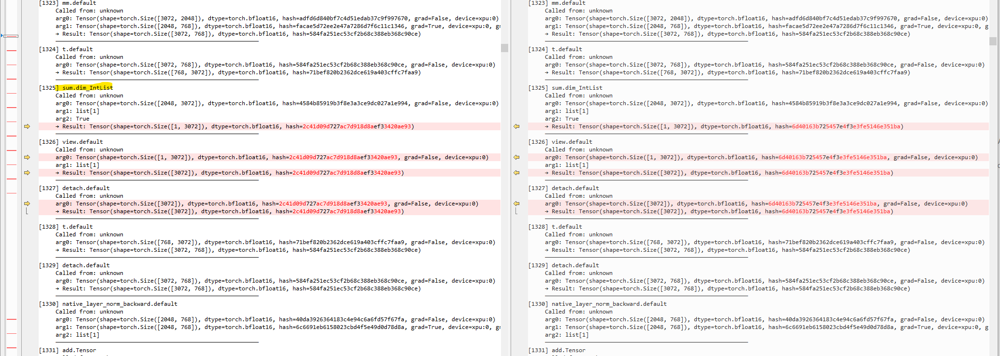

# `hash_accuracy_trace` tool

This tool is developed to debug pytorch benchmark accuracy consistency issue, such as the accuracy report `eager_two_runs_differ` issue.

During the model accuracy test, many kernels was called and we didn't which kernel has consistency issue. And cause the final result occurred consistency issue. This tool can trace every kernel and calculate the tensor's hash trace log. When we collect two pieces logs with `deterministic` mode. And then we can easy to locate the issue kernel by hash comparsion.

## How to use:

1. Copy `hash_accuracy_trace.py` file to `pytorch/benchmarks/dynamo/` directory.

2. Import `HashDebugTrace` in `pytorch/benchmarks/dynamo/common.py`, and collect hash trace for `correct_result` and `correct_rerun_result`. Detailed patch shows as below.

```patch
diff --git a/benchmarks/dynamo/common.py b/benchmarks/dynamo/common.py
index 0f5850058c7..f9cac6e13c4 100644
--- a/benchmarks/dynamo/common.py
+++ b/benchmarks/dynamo/common.py
@@ -2231,16 +2231,23 @@ class BenchmarkRunner:
             model, example_inputs = self.maybe_cast(model, example_inputs)
             accuracy_status = "pass"

+            from hash_accuracy_trace import HashDebugTrace
+
             # Get results of native pytorch
             reset_rng_state()
             model_copy = None
             try:
-                with torch.compiler.set_stance("force_eager"):
-                    model_copy = self.deepcopy_and_maybe_parallelize(model)
-                    self.init_optimizer(name, current_device, model_copy.parameters())
-                    correct_result = self.run_n_iterations(
-                        model_copy, clone_inputs(example_inputs), self.model_iter_fn
-                    )
+                with HashDebugTrace(
+                    log_path=f"trace_first.log",
+                ) as debug_1:
+                    with torch.compiler.set_stance("force_eager"):
+                        model_copy = self.deepcopy_and_maybe_parallelize(model)
+                        self.init_optimizer(
+                            name, current_device, model_copy.parameters()
+                        )
+                        correct_result = self.run_n_iterations(
+                            model_copy, clone_inputs(example_inputs), self.model_iter_fn
+                        )
             except Exception as e:
                 accuracy_status = (
                     "eager_1st_run_OOM"
@@ -2257,12 +2264,17 @@ class BenchmarkRunner:
             reset_rng_state()
             model_copy = None
             try:
-                with torch.compiler.set_stance("force_eager"):
-                    model_copy = self.deepcopy_and_maybe_parallelize(model)
-                    self.init_optimizer(name, current_device, model_copy.parameters())
-                    correct_rerun_result = self.run_n_iterations(
-                        model_copy, clone_inputs(example_inputs), self.model_iter_fn
-                    )
+                with HashDebugTrace(
+                    log_path=f"trace_second.log",
+                ) as debug_2:
+                    with torch.compiler.set_stance("force_eager"):
+                        model_copy = self.deepcopy_and_maybe_parallelize(model)
+                        self.init_optimizer(
+                            name, current_device, model_copy.parameters()
+                        )
+                        correct_rerun_result = self.run_n_iterations(
+                            model_copy, clone_inputs(example_inputs), self.model_iter_fn
+                        )
             except Exception as e:
                 accuracy_status = (
                     "eager_2nd_run_OOM"
```

3. When the test completed, it should collected two logs in `current working directory`. Let's use diff tool to compare the two logs, it should shows the un-consistency kernels as below.


